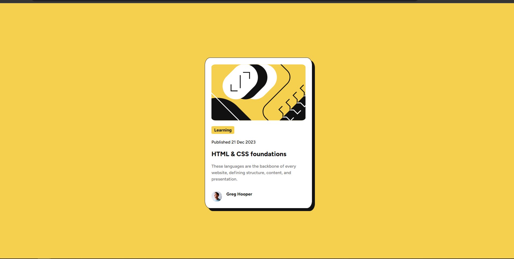
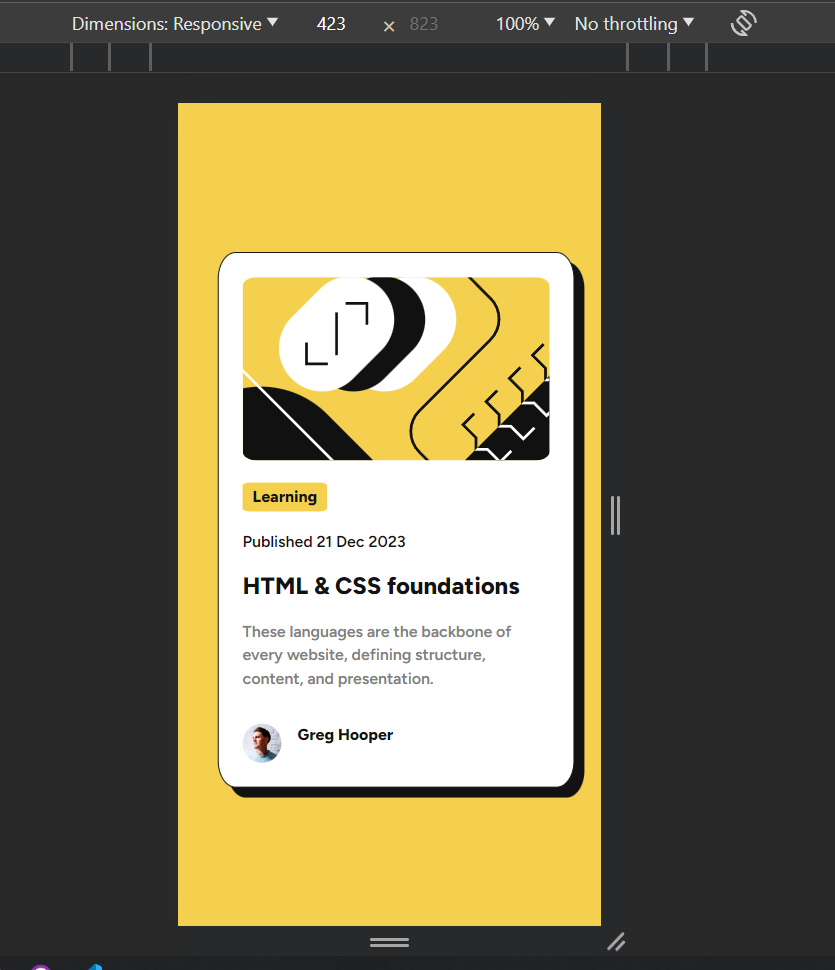

# Frontend Mentor - Blog preview card solution

This is a solution to the [Blog preview card challenge on Frontend Mentor](https://www.frontendmentor.io/challenges/blog-preview-card-ckPaj01IcS). Frontend Mentor challenges help you improve your coding skills by building realistic projects.

Solution URL: https://bigbobandy.github.io/Blog-Preview-Card-Frontend-Mentor/

## Table of contents

- [Overview](#overview)
  - [The challenge](#the-challenge)
  - [Screenshot](#screenshot)
- [My process](#my-process)
  - [Built with](#built-with)
  - [What I learned](#what-i-learned)
  - [Continued development](#continued-development)
  - [Useful resources](#useful-resources)
- [Author](#author)

## Overview

### The challenge

Users should be able to:

- See hover and focus states for all interactive elements on the page

### Screenshot

## My process

HTML Structure: Created HTML elements based on the design images, focusing on the correct layout and placement.

Mobile-First CSS: Started styling with a mobile-first approach. I used Chrome's DevTools to set the site into mobile mode, ensuring everything looked good on smaller screens.

Responsive Design: Once satisfied with the mobile view, I introduced media queries to adapt the layout for larger screens.

### Built with

- Semantic HTML5 markup
- CSS custom properties
- Flexbox
- Mobile-first workflow

### What I learned

This project, although beginner-friendly, was an excellent opportunity for me to solidify my understanding of key web development concepts. One of the most significant areas I focused on was media queries in CSS. This aspect of responsive design is something I've been eager to master, and through this project, I've gained a much clearer understanding and practical experience.

### Continued development

In my future projects, I want to focus heavily on mastering responsive web design. Ensuring that a site looks good and functions well on any screen size is crucial, and it's an area I've always found challenging. I plan to delve deeper into CSS frameworks, media queries, and flexible layouts to build more fluid and adaptable web pages.

Additionally, I aim to improve my skills in translating designs into functional web pages. This involves taking a design concept, whether it's an image, a sketch, or a digital design, and accurately converting it into a working website. To sharpen these skills, participating in challenges on platforms like Frontend Mentor will be a key part of my learning process. These challenges provide practical experience in implementing complex designs and help bridge the gap between design and development in real-world scenarios.

### Useful resources

- https://www.w3schools.com - A great resource for learning CSS properties. Their straightforward explanations and examples made understanding CSS much easier. Highly recommended for anyone starting with CSS.

- https://www.thinkful.com/blog/web-developer-cheat-sheet/ - Excellent cheat sheet for quick reference and brushing up on web development concepts.

## Author

- Website - [Jackson](https://www.jdykes.dev)
- GitHub - [BigBobandy] (https://github.com/BigBobandy)
- Frontend Mentor - [@BigBobandy](https://www.frontendmentor.io/profile/BigBobandy)
